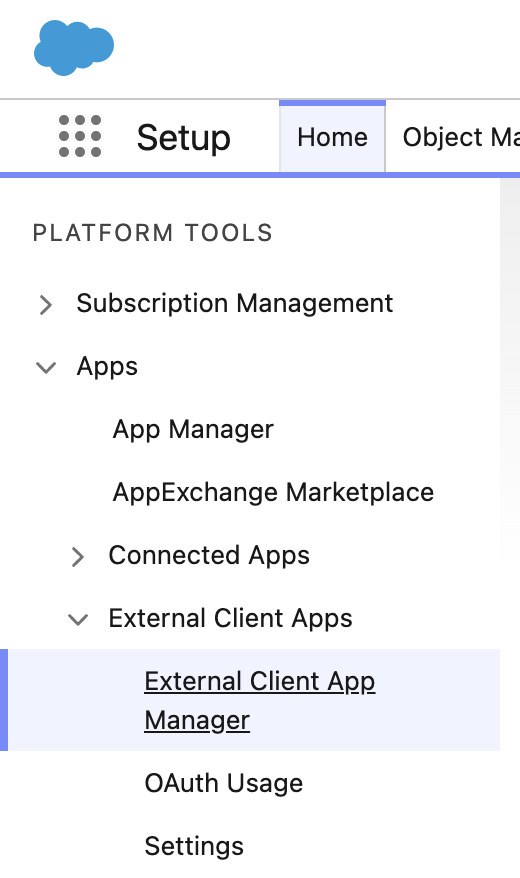
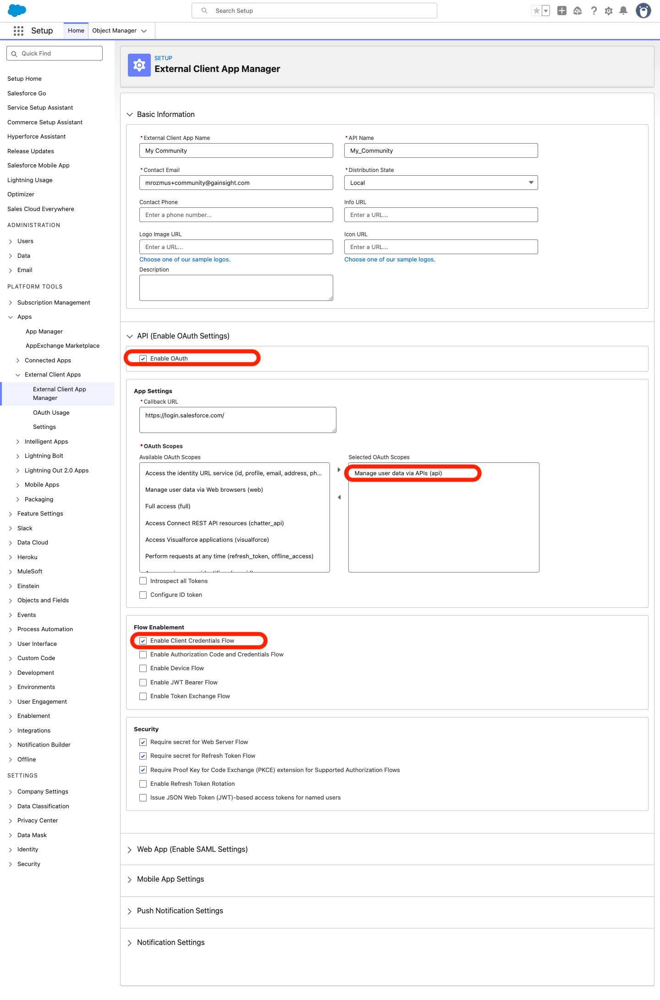
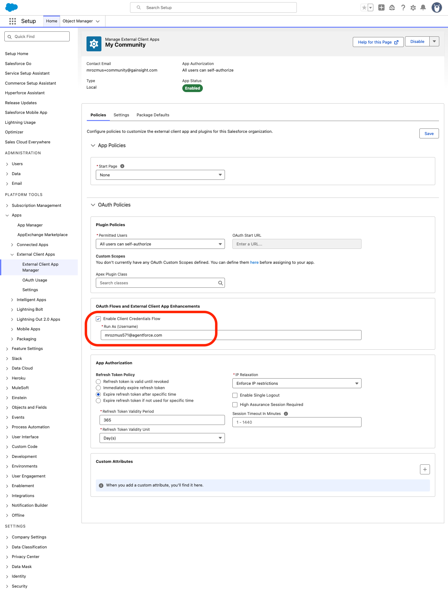
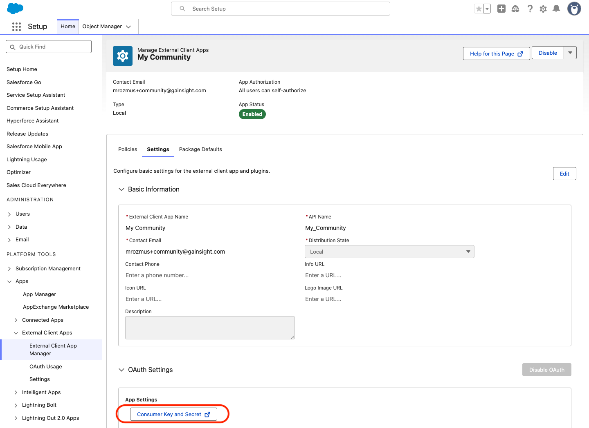
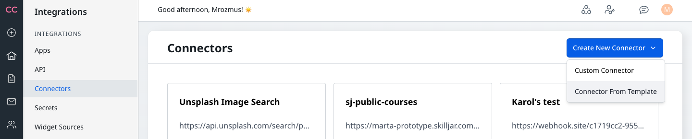
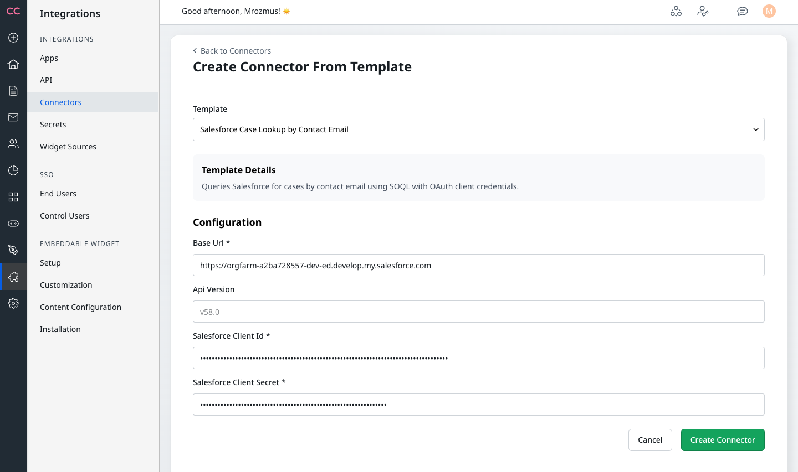
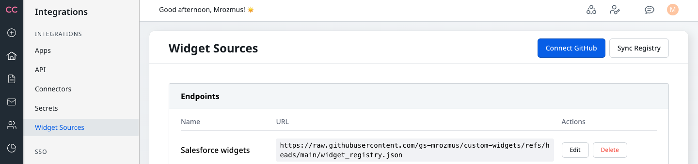
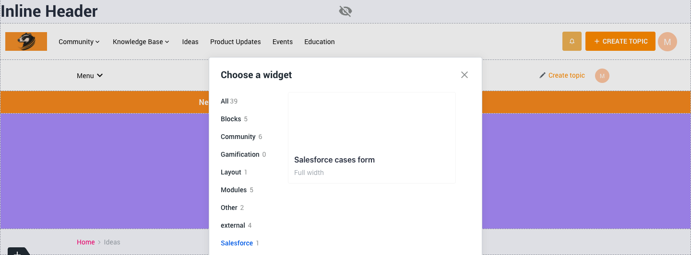
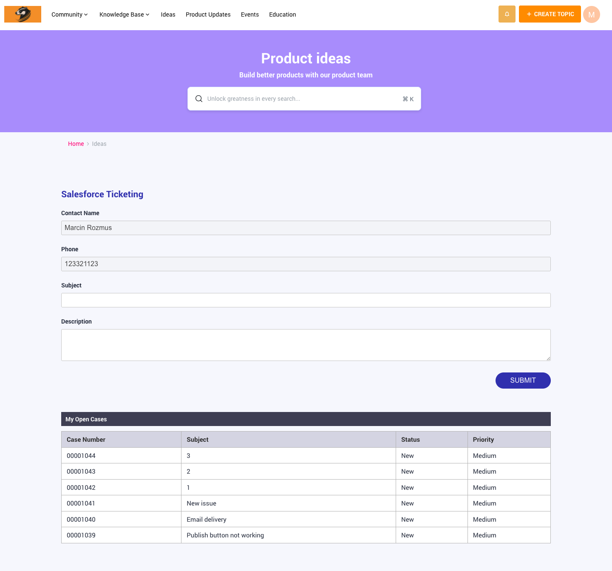

# Salesforce Cases Form Widget

This widget integrates with your Salesforce instance to enable case management directly from your community. Follow the setup steps below to get started.

---

## Prerequisites

- Access to your Salesforce instance with administrator privileges
- Access to your community administration panel

---

## Setup Instructions

### Step 1: Create External Client App in Salesforce

Navigate to your Salesforce instance:  
**Settings → Platform Tools → Apps → External Client Apps → External Client App Manager**

### Step 2: Create New External Client App

Click to create a new External Client App.

### Step 3: Enable Client Credentials Flow

Enable the Client Credentials Flow for your app.

### Step 4: Retrieve Consumer Key and Secret

Copy your Consumer Key and Consumer Secret — you'll need these for the connector configuration.

### Step 5: Create Connectors from Templates

In your community admin panel, create new connectors from the available templates.

> **Required Connectors:**  
> You need to create all four of these connectors:
> - Salesforce Case Lookup by Contact Email
> - Salesforce Contact Lookup by Email
> - Salesforce Create Case for Contact
> - Salesforce Create Contact and Case

Provide the URL to your Salesforce instance along with the Consumer Key and Secret.

### Step 6: Add Widget Source Repository

Add the current repository `https://raw.githubusercontent.com/gs-mrozmus/custom-widgets/refs/heads/main/widget_registry.json` to your Widget Sources by `Add New Endpoint` button.

### Step 7: Add Widget to Your Community

Add the new Salesforce Cases widget to your community.

---

## Widget Preview

### Signed-in Users

For authenticated users, the widget displays their existing cases and allows creating new ones:

### Anonymous Users

For visitors who are not signed in, the widget shows a disabled form:

